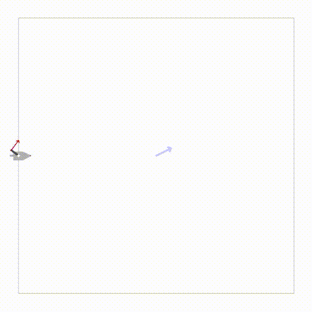
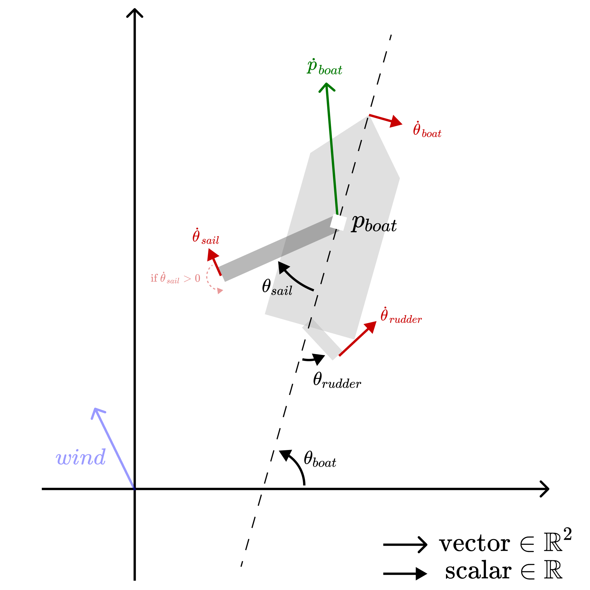

# Sailboat Gym ⛵



Welcome to Sailboat Gym! This repository provides a dynamic simulation environment specifically designed for sailboats. With Sailboat Gym, you can explore and experiment with different control algorithms and strategies in a realistic virtual sailing environment.

## Table of Contents

- [Installation (Docker Needed)](#installation-docker-needed)
- [Usage](#usage)
- [Environment](#environment)
  - [Description](#description)
  - [Limitations](#limitations)
  - [Observation Space](#observation-space)
  - [Action Space](#action-space)
  - [Reward Function](#reward-function)
  - [Rendering](#rendering)
- [Documentation](#documentation)
- [Contributing](#contributing)
- [License](#license)

## Installation (Docker Needed)

**Pre-requirement: Please make sure you have [Docker](https://www.docker.com/) installed and running on your machine.**

To install and set up Sailboat Gym, follow these steps:

1. Clone the repository:

   ```bash
   git clone https://github.com/lucasmrdt/sailboat-gym.git
   cd sailboat-gym
   ```

2. Install the required dependencies:

   ```bash
   pip install -r requirements.txt
   ```

## Usage

To run a simple example in Sailboat Gym, use the following command:

```bash
python3 example.py
```

Alternatively, you can use the following code snippet in your Python script:

```python
import gymnasium as gym
from gymnasium.wrappers.record_video import RecordVideo
import sailboat_gym

env = gym.make('SailboatLSAEnv-v0', renderer=sailboat_gym.CV2DRenderer())
env = RecordVideo(env, video_folder='./output/videos/')

env.reset(seed=10)

while True:
    act = env.action_space.sample()
    obs, reward, terminated, truncated, info = env.step(act)
    if truncated:
        break
    env.render()

env.close()
```

This example demonstrates how to create an instance of the `SailboatLSAEnv` environment and record a video of the simulation.

## Environment

### Description

The Sailboat Gym simulation is conducted using the [Gazebo](http://gazebosim.org/) simulator and implemented through the [usv_sim_lsa project](https://github.com/disaster-robotics-proalertas/usv_sim_lsa), encapsulated inside a Docker. The Docker images/containers are handled automatically by the environment, so you don't have to worry about them.

The simulation incorporates various forces, such as hydrodynamic, hydrostatic, wind, wave, and thruster forces, using an enhanced version of the [Free-Floating Plugin](https://github.com/disaster-robotics-proalertas/freefloating_gazebo/tree/713bb6ab69d8d748906ea8eabb21da56b7db5562). Additionally, it incorporates lift and drag forces acting on the boat's rudder, keel, and/or sail through the Foil Dynamics Plugin. For more detailed information about the simulation, please consult the [original paper](https://www.mdpi.com/1424-8220/19/5/1117).

### Limitations

The current Docker version of the simulation does not include wave simulations. The calculation of waves relies on the [UWSim Plugin](https://github.com/uji-ros-pkg/underwater_simulation), which heavily depends on [OpenSceneGraph](http://www.openscenegraph.com/). By default, OpenSceneGraph requires creating a window and rendering the scene, making it challenging to run within a Docker container. Nevertheless, we are actively working on finding a solution to this issue.

### Observation Space



The sailboat's state is described by the following variables:

- `p_boat` / $\mathbf{p}_{\text{boat}}$ (position of the boat in the world frame, 3D vector)
- `dt_p_boat` / $\dot{\mathbf{p}}_{\text{boat}}$ (velocity of the boat in the world frame, 3D vector)
- `theta_boat` / $\boldsymbol{\theta}_{\text{boat}}$ (orientation of the boat in the world frame - roll, pitch, and yaw)
- `dt_theta_boat` / $\dot{\boldsymbol{\theta}}_{\text{boat}}$ (relative angular velocity of the boat)
- `theta_rudder` / $\theta_{\text{rudder}}$ (relative orientation of the rudder)
- `dt_theta_rudder` / $\dot{\theta}_{\text{rudder}}$ (relative angular velocity of the rudder)
- `theta_sail` / $\theta_{\text{sail}}$ (relative orientation of the sail)
- `dt_theta_sail` / $\dot{\theta}_{\text{sail}}$ (relative angular velocity of the sail)
- `wind` / $\mathbf{wind}$ (wind velocity in the world frame - x and y components)

### Action Space

The sailboat's action is described by the following variables:

- `theta_rudder` / $\theta_{\text{rudder}}$ (relative orientation of the rudder)
- `theta_sail` / $\theta_{\text{sail}}$ (relative orientation of the sail)

### Reward Function

You are responsible for defining the reward function based on the specific task you aim to accomplish. The reward function takes the current state and the action taken by the agent as input and returns a scalar value. For example, the following reward function returns the negative distance between the boat and the goal:

```python
goal = np.array([0, 0, 0])

def reward_fn(state, action):
    return -np.linalg.norm(state['p_boat'] - goal)
```

### Rendering

Currently, Sailboat Gym provides 2D rendering of the simulation. The rendering is done using the [CV2DRenderer](./sailboat_gym/envs/renderers/cv2d_renderer.py) class, which utilizes the [OpenCV](https://opencv.org/) library to render the simulation based on the observation. It may be possible to implement 3D rendering using libraries such as [Open3D](http://www.open3d.org/), but this feature has not been implemented yet.

## Documentation

For detailed information on the API, usage examples, and customization options, please refer to our [documentation](./DOCUMENTATION.md).

## Contributing

We welcome contributions to Sailboat Gym. Please refer to our [contributing guidelines](./CONTRIBUTING.md) for more information.

## License

Sailboat Gym is released under the [MIT License](./LICENSE). You are free to use, modify, and distribute this software for both commercial and non-commercial purposes.